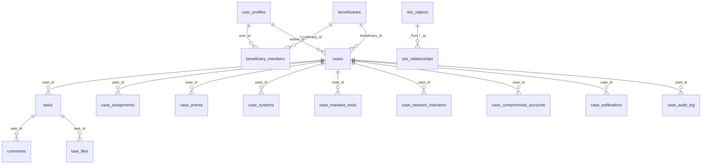

# Schéma de base de données ORIS

> **Base de données** : ArangoDB  
> **Nom de la base** : `oris`  
> **Type** : Document store + Edge collection (graphe STIX)

---

## Vue d'ensemble

---

## Collections documentaires

### `user_profiles`

Comptes utilisateurs avec authentification.

| Champ | Type | Description |
|-------|------|-------------|
| `_key` (id) | UUID | Identifiant unique |
| `email` | string | Email (unique, indexé) |
| `password_hash` | string | Hash bcrypt du mot de passe |
| `full_name` | string | Nom complet |
| `role` | string | Rôle global (`admin`, `user`, `team_leader`) |
| `avatar_url` | string? | Chemin de l'avatar |
| `totp_secret` | string? | Clé secrète TOTP (2FA) |
| `totp_enabled` | boolean | 2FA activé |
| `is_active` | boolean | Compte actif |
| `pin_hash` | string? | Hash du PIN de verrouillage |
| `created_at` | ISO 8601 | Date de création |
| `updated_at` | ISO 8601 | Date de modification |

---

### `beneficiaries`

Organisations bénéficiaires des services CSIRT.

| Champ | Type | Description |
|-------|------|-------------|
| `_key` (id) | UUID | Identifiant unique |
| `name` | string | Nom de l'organisation |
| `created_at` | ISO 8601 | Date de création |
| `updated_at` | ISO 8601 | Date de modification |

---

### `beneficiary_members`

Association utilisateur ↔ bénéficiaire avec rôles par bénéficiaire.

| Champ | Type | Description |
|-------|------|-------------|
| `_key` (id) | UUID | Identifiant unique |
| `user_id` | UUID | FK → `user_profiles._key` |
| `beneficiary_id` | UUID | FK → `beneficiaries._key` |
| `role` | JSON string | Rôles per-bénéficiaire (ex: `["case_analyst","alert_analyst"]`) |
| `is_team_leader` | boolean | Team lead pour ce bénéficiaire |
| `created_at` | ISO 8601 | Date de création |
| `updated_at` | ISO 8601 | Date de modification |

---

### `cases`

Dossiers d'incident et alertes (différenciés par `type`).

| Champ | Type | Description |
|-------|------|-------------|
| `_key` (id) | UUID | Identifiant unique |
| `case_number` | string | Numéro auto-généré (ex: `2026-00001`) |
| `type` | string | `'case'` ou `'alert'` |
| `title` | string | Titre du dossier |
| `description` | string | Description (HTML) |
| `status` | string | `'open'` ou `'closed'` |
| `severity_id` | string | FK → `severities._key` |
| `tlp` | string | Code TLP (`RED`, `AMBER`, `GREEN`, `CLEAR`) |
| `pap` | string | Code PAP (`RED`, `AMBER`, `GREEN`, `CLEAR`) |
| `author_id` | UUID | FK → `user_profiles._key` |
| `beneficiary_id` | UUID | FK → `beneficiaries._key` |
| `kill_chain_type` | string? | `'mitre_attack'` ou `'cyber_kill_chain'` |
| `attacker_utc_offset` | string? | Fuseau horaire de l'attaquant |
| `closed_at` | ISO 8601? | Date de clôture |
| `closed_by` | UUID? | FK → `user_profiles._key` |
| `created_at` | ISO 8601 | Date de création |
| `updated_at` | ISO 8601 | Date de modification |

> 📌 Index unique sur `case_number`. Index sur `beneficiary_id`, `status`.

---

### `tasks`

Tâches d'investigation liées à un dossier.

| Champ | Type | Description |
|-------|------|-------------|
| `_key` (id) | UUID | Identifiant unique |
| `case_id` | UUID | FK → `cases._key` |
| `title` | string | Titre de la tâche |
| `description` | string? | Description (HTML) |
| `status` | string | `'todo'`, `'in_progress'`, `'done'` |
| `priority` | string | `'low'`, `'medium'`, `'high'`, `'critical'` |
| `assigned_to` | UUID? | FK → `user_profiles._key` |
| `author_id` | UUID | FK → `user_profiles._key` |
| `due_date` | ISO 8601? | Date d'échéance |
| `result_id` | string? | FK → `task_results._key` |
| `position` | number | Ordre d'affichage |
| `created_at` | ISO 8601 | Date de création |
| `updated_at` | ISO 8601 | Date de modification |

> 📌 Index sur `case_id`, `assigned_to`.

---

### `case_assignments`

Association investigateur ↔ dossier (équipe).

| Champ | Type | Description |
|-------|------|-------------|
| `_key` (id) | UUID | Identifiant unique |
| `case_id` | UUID | FK → `cases._key` |
| `user_id` | UUID | FK → `user_profiles._key` |
| `created_at` | ISO 8601 | Date de création |

> 📌 Index sur `case_id`, `user_id`.

---

### `case_events`

Événements de la timeline d'investigation.

| Champ | Type | Description |
|-------|------|-------------|
| `_key` (id) | UUID | Identifiant unique |
| `case_id` | UUID | FK → `cases._key` |
| `task_id` | UUID? | FK → `tasks._key` |
| `description` | string | Description de l'événement |
| `event_datetime` | ISO 8601 | Horodatage de l'événement |
| `kill_chain` | string? | Phase kill chain |
| `source_system_id` | UUID? | FK → `case_systems._key` |
| `target_system_id` | UUID? | FK → `case_systems._key` |
| `malware_id` | UUID? | FK → `case_malware_tools._key` |
| `compromised_account_id` | UUID? | FK → `case_compromised_accounts._key` |
| `exfiltration_id` | UUID? | FK → `case_exfiltrations._key` |
| `created_by` | UUID | FK → `user_profiles._key` |
| `created_at` | ISO 8601 | Date de création |
| `updated_at` | ISO 8601 | Date de modification |

> 📌 Index sur `case_id`, `task_id`.

---

### `case_systems`

Systèmes impliqués dans un incident.

| Champ | Type | Description |
|-------|------|-------------|
| `_key` (id) | UUID | Identifiant unique |
| `case_id` | UUID | FK → `cases._key` |
| `task_id` | UUID? | FK → `tasks._key` |
| `name` | string | Nom du système (hostname) |
| `system_type` | string | Type (serveur, poste de travail, etc.) |
| `ip_addresses` | array | Adresses IP |
| `owner` | string? | Propriétaire |
| `network_indicator_id` | UUID? | FK → `case_network_indicators._key` |
| `investigation_status` | string? | Statut d'investigation |
| `created_by` | UUID | FK → `user_profiles._key` |
| `created_at` | ISO 8601 | Date de création |
| `updated_at` | ISO 8601 | Date de modification |

---

### `case_malware_tools`

Malwares et outils découverts.

| Champ | Type | Description |
|-------|------|-------------|
| `_key` (id) | UUID | Identifiant unique |
| `case_id` | UUID | FK → `cases._key` |
| `task_id` | UUID? | FK → `tasks._key` |
| `system_id` | UUID? | FK → `case_systems._key` |
| `file_name` | string | Nom du fichier |
| `file_path` | string? | Chemin du fichier |
| `hashes` | string? | Empreintes (SHA-256, MD5) |
| `description` | string? | Description |
| `is_malicious` | boolean | Malveillant confirmé |
| `creation_date` | ISO 8601? | Date de création du fichier |
| `modification_date` | ISO 8601? | Date de modification du fichier |
| `created_by` | UUID | FK → `user_profiles._key` |
| `created_at` | ISO 8601 | Date de création |
| `updated_at` | ISO 8601 | Date de modification |
| `updated_by` | UUID? | Dernier modificateur |

---

### `case_network_indicators`

Indicateurs réseau (IOC).

| Champ | Type | Description |
|-------|------|-------------|
| `_key` (id) | UUID | Identifiant unique |
| `case_id` | UUID | FK → `cases._key` |
| `task_id` | UUID? | FK → `tasks._key` |
| `ip` | string? | Adresse IP |
| `domain_name` | string? | Nom de domaine |
| `port` | number? | Port |
| `url` | string? | URL complète |
| `context` | string? | Contexte (C2, exfiltration, etc.) |
| `first_activity` | ISO 8601? | Première activité observée |
| `last_activity` | ISO 8601? | Dernière activité observée |
| `malware_id` | UUID? | FK → `case_malware_tools._key` |
| `created_by` | UUID | FK → `user_profiles._key` |
| `created_at` | ISO 8601 | Date de création |
| `updated_at` | ISO 8601 | Date de modification |
| `updated_by` | UUID? | Dernier modificateur |

---

### `case_compromised_accounts`

Comptes compromis.

| Champ | Type | Description |
|-------|------|-------------|
| `_key` (id) | UUID | Identifiant unique |
| `case_id` | UUID | FK → `cases._key` |
| `task_id` | UUID? | FK → `tasks._key` |
| `system_id` | UUID? | FK → `case_systems._key` |
| `account_name` | string | Nom de compte |
| `domain` | string? | Domaine AD |
| `sid` | string? | SID Windows |
| `privileges` | string? | Niveau de privilège |
| `context` | string? | Contexte |
| `first_malicious_activity` | ISO 8601? | Première activité malveillante |
| `last_malicious_activity` | ISO 8601? | Dernière activité malveillante |
| `created_by` | UUID | FK → `user_profiles._key` |
| `created_at` | ISO 8601 | Date de création |
| `updated_at` | ISO 8601 | Date de modification |
| `updated_by` | UUID? | Dernier modificateur |

---

### `case_compromised_account_systems`

Lien N:N entre comptes compromis et systèmes.

| Champ | Type | Description |
|-------|------|-------------|
| `_key` (id) | UUID | Identifiant unique |
| `account_id` | UUID | FK → `case_compromised_accounts._key` |
| `system_id` | UUID | FK → `case_systems._key` |
| `created_at` | ISO 8601 | Date de création |

---

### `case_exfiltrations`

Exfiltrations de données identifiées.

| Champ | Type | Description |
|-------|------|-------------|
| `_key` (id) | UUID | Identifiant unique |
| `case_id` | UUID | FK → `cases._key` |
| `task_id` | UUID? | FK → `tasks._key` |
| `exfiltration_date` | ISO 8601? | Date de l'exfiltration |
| `source_system_id` | UUID? | FK → `case_systems._key` |
| `exfil_system_id` | UUID? | Système d'exfiltration |
| `destination_system_id` | UUID? | FK → `case_systems._key` |
| `file_name` | string? | Fichier exfiltré |
| `file_size` | number? | Taille |
| `file_size_unit` | string? | Unité (`KB`, `MB`, `GB`) |
| `content_description` | string? | Description du contenu |
| `other_info` | string? | Informations complémentaires |
| `created_by` | UUID | FK → `user_profiles._key` |
| `created_at` | ISO 8601 | Date de création |
| `updated_at` | ISO 8601 | Date de modification |
| `updated_by` | UUID? | Dernier modificateur |

---

### `case_diamond_overrides`

Surcharges manuelles du modèle Diamond.

| Champ | Type | Description |
|-------|------|-------------|
| `_key` (id) | UUID | Identifiant unique |
| `case_id` | UUID | FK → `cases._key` |
| `event_id` | UUID? | FK → `case_events._key` |
| `label` | string? | Label personnalisé |
| `adversary` | string? | Adversaire |
| `infrastructure` | string? | Infrastructure |
| `capability` | string? | Capacité |
| `victim` | string? | Victime |
| `notes` | string? | Notes |
| `created_at` | ISO 8601 | Date de création |
| `updated_at` | ISO 8601 | Date de modification |
| `updated_by` | UUID? | Dernier modificateur |

---

### `case_diamond_node_order`

Ordre des nœuds dans le graphe Diamond.

| Champ | Type | Description |
|-------|------|-------------|
| `_key` (id) | UUID | Identifiant unique |
| `case_id` | UUID | FK → `cases._key` |
| `node_order` | JSON | Ordre des nœuds |
| `created_at` | ISO 8601 | Date de création |
| `updated_at` | ISO 8601 | Date de modification |

---

### `case_graph_layouts`

Positions sauvegardées des graphes.

| Champ | Type | Description |
|-------|------|-------------|
| `_key` (id) | UUID | Identifiant unique |
| `case_id` | UUID | FK → `cases._key` |
| `graph_type` | string | Type de graphe |
| `layout_data` | JSON | Positions des nœuds |
| `created_at` | ISO 8601 | Date de création |
| `updated_at` | ISO 8601 | Date de modification |

---

### `case_attacker_infra`

Infrastructure de l'attaquant (C2, serveurs).

| Champ | Type | Description |
|-------|------|-------------|
| `_key` (id) | UUID | Identifiant unique |
| `case_id` | UUID | FK → `cases._key` |
| `name` | string | Nom |
| `infra_type` | string | Type d'infrastructure |
| `ip_addresses` | array? | Adresses IP |
| `network_indicator_id` | UUID? | FK → `case_network_indicators._key` |
| `description` | string? | Description |
| `created_by` | UUID | FK → `user_profiles._key` |
| `created_at` | ISO 8601 | Date de création |
| `updated_at` | ISO 8601 | Date de modification |

---

### `case_audit_log`

Journal d'audit des dossiers.

| Champ | Type | Description |
|-------|------|-------------|
| `_key` (id) | UUID | Identifiant unique |
| `case_id` | UUID | FK → `cases._key` |
| `user_id` | UUID | FK → `user_profiles._key` |
| `action` | string | Type d'action (ex: `member_added`, `status_changed`) |
| `entity_type` | string | Type d'entité modifiée |
| `entity_id` | string? | ID de l'entité modifiée |
| `details` | JSON string | Détails de l'action |
| `created_at` | ISO 8601 | Date |

> 📌 Index sur `case_id`.

---

### `comments`

Commentaires sur les tâches.

| Champ | Type | Description |
|-------|------|-------------|
| `_key` (id) | UUID | Identifiant unique |
| `case_id` | UUID | FK → `cases._key` |
| `task_id` | UUID? | FK → `tasks._key` |
| `user_id` | UUID | FK → `user_profiles._key` |
| `content` | string | Contenu du commentaire |
| `parent_id` | UUID? | FK → `comments._key` (réponse) |
| `created_at` | ISO 8601 | Date de création |
| `updated_at` | ISO 8601 | Date de modification |

---

### `comment_attachments`

Pièces jointes des commentaires.

| Champ | Type | Description |
|-------|------|-------------|
| `_key` (id) | UUID | Identifiant unique |
| `comment_id` | UUID | FK → `comments._key` |
| `filename` | string | Nom du fichier |
| `path` | string | Chemin sur disque |
| `mime_type` | string | Type MIME |
| `size` | number | Taille en octets |
| `created_at` | ISO 8601 | Date de création |

---

### `task_files`

Fichiers attachés aux tâches.

| Champ | Type | Description |
|-------|------|-------------|
| `_key` (id) | UUID | Identifiant unique |
| `task_id` | UUID | FK → `tasks._key` |
| `filename` | string | Nom du fichier |
| `path` | string | Chemin sur disque |
| `mime_type` | string | Type MIME |
| `size` | number | Taille en octets |
| `uploaded_by` | UUID | FK → `user_profiles._key` |
| `created_at` | ISO 8601 | Date de création |

---

### `notifications`

Notifications utilisateur.

| Champ | Type | Description |
|-------|------|-------------|
| `_key` (id) | UUID | Identifiant unique |
| `user_id` | UUID | FK → `user_profiles._key` |
| `type` | string | Type de notification |
| `title` | string | Titre |
| `message` | string | Message |
| `link` | string? | Lien associé |
| `read` | boolean | Lu / non lu |
| `metadata` | JSON? | Métadonnées supplémentaires |
| `created_at` | ISO 8601 | Date de création |

> 📌 Index sur `user_id`.

---

### `webhooks`

Webhooks configurés.

| Champ | Type | Description |
|-------|------|-------------|
| `_key` (id) | UUID | Identifiant unique |
| `name` | string | Nom du webhook |
| `url` | string | URL de destination |
| `secret` | string | Secret de signature HMAC |
| `events` | array | Types d'événements souscrits |
| `is_active` | boolean | Actif / inactif |
| `created_at` | ISO 8601 | Date de création |
| `updated_at` | ISO 8601 | Date de modification |

---

### `push_subscriptions`

Abonnements aux notifications push (Web Push).

| Champ | Type | Description |
|-------|------|-------------|
| `_key` (id) | UUID | Identifiant unique |
| `user_id` | UUID | FK → `user_profiles._key` |
| `subscription` | JSON | Objet PushSubscription W3C |
| `created_at` | ISO 8601 | Date de création |

---

### `login_history`

Historique des connexions.

| Champ | Type | Description |
|-------|------|-------------|
| `_key` (id) | UUID | Identifiant unique |
| `user_id` | UUID | FK → `user_profiles._key` |
| `ip_address` | string | Adresse IP |
| `user_agent` | string | User-Agent |
| `success` | boolean | Connexion réussie |
| `created_at` | ISO 8601 | Date |

---

### `api_tokens`

Tokens d'API pour intégrations.

| Champ | Type | Description |
|-------|------|-------------|
| `_key` (id) | UUID | Identifiant unique |
| `user_id` | UUID | FK → `user_profiles._key` |
| `name` | string | Nom du token |
| `token_hash` | string | Hash du token |
| `last_used` | ISO 8601? | Dernière utilisation |
| `created_at` | ISO 8601 | Date de création |

---

## Collections de configuration (seed)

### `severities`

| `_key` | `label` | `color` | `level` |
|--------|---------|---------|---------|
| `sev-info` | Informationnel | `#3b82f6` | 0 |
| `sev-low` | Faible | `#22c55e` | 1 |
| `sev-medium` | Moyenne | `#f59e0b` | 2 |
| `sev-high` | Élevée | `#ef4444` | 3 |
| `sev-critical` | Critique | `#7c3aed` | 4 |

### `task_results`

| `_key` | `label` | `color` |
|--------|---------|---------|
| `result-ok` | Conforme | `#22c55e` |
| `result-nok` | Non conforme | `#ef4444` |
| `result-na` | Non applicable | `#6b7280` |
| `result-partial` | Partiel | `#f59e0b` |

### `system_config`

| `_key` | `provider` | `model` | `api_key` |
|--------|-----------|---------|-----------|
| `ai_config` | `none` | *(vide)* | *(vide)* |

### `kill_chain_ttps`

Techniques MITRE ATT&CK et Cyber Kill Chain préconfigurées.

| Champ | Type | Description |
|-------|------|-------------|
| `_key` | string | ID (ex: `ttp-t1566`) |
| `kill_chain_type` | string | `mitre_attack` ou `cyber_kill_chain` |
| `phase_value` | string | Phase de la kill chain |
| `ttp_id` | string | ID technique (ex: `T1566`) |
| `name` | string | Nom de la technique |
| `description` | string | Description |
| `url` | string? | Lien MITRE |
| `order` | number | Ordre d'affichage |

---

## Collections de graphe STIX 2.1

### `stix_objects` (collection documentaire)

Objets STIX (SDO + SCO) stockés comme sommets du graphe.

| Champ | Type | Description |
|-------|------|-------------|
| `_key` | STIX ID | Format `<type>--<UUID>` |
| `case_id` | UUID | FK → `cases._key` |
| `type` | string | Type STIX (ex: `malware`, `infrastructure`, `ipv4-addr`) |
| `spec_version` | string | `2.1` |
| `data` | JSON | Objet STIX complet conforme OASIS |
| `created_by_user_id` | string | Auteur (`user` ou `system`) |
| `created_at` | ISO 8601 | Date de création |
| `updated_at` | ISO 8601 | Date de modification |

> 📌 Index sur `case_id`, `type`.

### `stix_relationships` (collection edge)

Relations STIX (SRO) stockées comme arêtes du graphe.

| Champ | Type | Description |
|-------|------|-------------|
| `_key` | STIX ID | Format `relationship--<UUID>` |
| `_from` | string | `stix_objects/<source_ref>` |
| `_to` | string | `stix_objects/<target_ref>` |
| `case_id` | UUID | FK → `cases._key` |
| `relationship_type` | string | Ex: `targets`, `uses`, `lateral-movement` |
| `data` | JSON | Objet SRO complet conforme OASIS |
| `created_by_user_id` | string | Auteur |
| `created_at` | ISO 8601 | Date de création |
| `updated_at` | ISO 8601 | Date de modification |

> 📌 Index sur `case_id`, `_from`, `_to`.

### Graphe nommé : `stix_graph`

- **Sommets** : `stix_objects`
- **Arêtes** : `stix_relationships` (from/to = `stix_objects`)

---

## Index

| Collection | Champ(s) | Type | Unique |
|------------|----------|------|--------|
| `cases` | `case_number` | persistent | ✅ |
| `cases` | `beneficiary_id` | persistent | ❌ |
| `cases` | `status` | persistent | ❌ |
| `case_events` | `case_id` | persistent | ❌ |
| `case_events` | `task_id` | persistent | ❌ |
| `tasks` | `case_id` | persistent | ❌ |
| `tasks` | `assigned_to` | persistent | ❌ |
| `stix_objects` | `case_id` | persistent | ❌ |
| `stix_objects` | `type` | persistent | ❌ |
| `stix_relationships` | `case_id` | persistent | ❌ |
| `stix_relationships` | `_from` | persistent | ❌ |
| `stix_relationships` | `_to` | persistent | ❌ |
| `user_profiles` | `email` | persistent | ✅ |
| `case_assignments` | `case_id` | persistent | ❌ |
| `case_assignments` | `user_id` | persistent | ❌ |
| `notifications` | `user_id` | persistent | ❌ |
| `case_audit_log` | `case_id` | persistent | ❌ |
